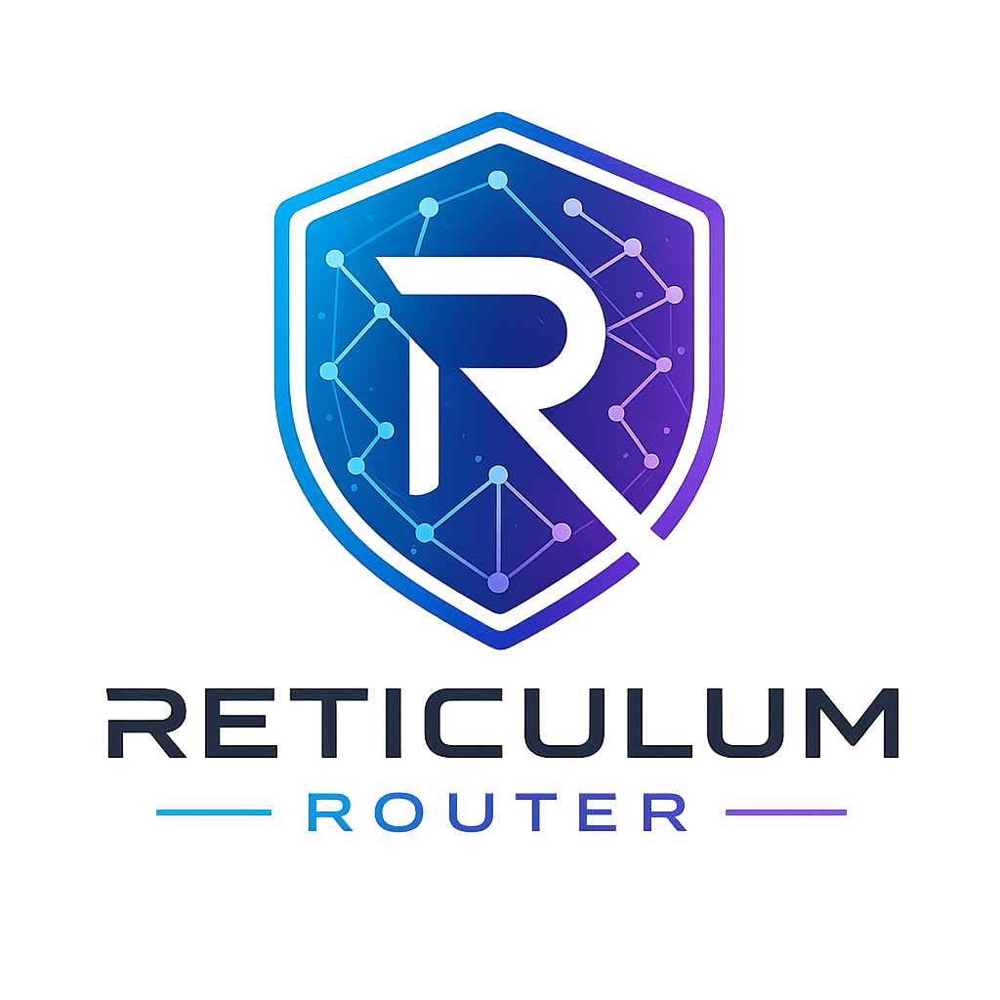

# Reticulum Router Daemon



A pure, rust-based transport for the Reticulum network based largely on [reticulum-sdk](https://github.com/GhostMeshLabs/reticulum-sdk)

## Implemented protocol features

* ✅ rnstransport path.request
* ✅ rnstransport probe (aka respond_to_probes)
* ✅ rnstransport discovery (aka discoverable)
* ❌ rnstransport remote.management (aka enable_remote_management)
* ❌ info blackhole (aka publish_blackhole)

## Implemented interfaces

> Physical communication interfaces implemented

### IP Network (LAN, WAN)

* ❌ AutoInterface
* ❌ BackboneInterface (Use TCPServerInterface instead for now)
* ❌ I2PInterface
* ✅ TCPClientInterface
* ✅ TCPServerInterface (bind_host ::1 will allow dual-stack functionality)
* ✅ UDPInterface

### Radio (HAM, LoRA)

* ❌ AX25KISSInterface
* ✅ [Modem73Interface](https://github.com/RFnexus/modem73)
* ✅ [RNodeInterface](https://unsigned.io/rnode/) (over Serial)
* ❌ RNodeMultiInterface
* ❌ KISSInterface

### Other

* ❌ BluetoothInterface
* ❌ PipeInterface
* ❌ SerialInterface

# Configuring

The Reticulum Router Daemon will automatically convert any existing non-standard Python rnsd configurations to standard toml config files.

> Not all interface types are supported yet! Just TCPServerInterface,TCPClientInterface,UDPInterface,RNodeInterface

## Differences from rnsd configuration

* toml
  * The config file is actually standard toml. reticulum-router will attempt to convert any
    existing non-standard Python rnsd config files to compatible toml (creating a new config
    called config.toml)
* toml location
  * We search ~/.reticulum for compatibility, then fall-back to a more standard ~/.config/reticulum
    config path.
* interfaces / discovery_name
  * Omitted. We just use interface name
* interfaces / reachable_on
  * We *DO* optionally want a port number, because sometimes things are behind load balancers
  * Does *NOT* accept a local script to execute to get your IP
    * (in the future, we want to detect your external IP if reachable_on is omitted)

## Example syntax

```toml
[reticulum]
enable_transport = true
share_instance = true
shared_instance_port = 37428
instance_control_port = 37429
rpc_key = "somethingsecretmatchingpythonrnsd"
instance_name = "default"
respond_to_probes = true

[logging]
loglevel = 5

[metrics]
enabled = false
bind_host = "127.0.0.1"
bind_port = 9090

[[interfaces]]
name = "Default Interface"
type = "AutoInterface"
enabled = false

[[interfaces]]
name = "Local"
type = "TCPServerInterface"
enabled = true
bind_host = "0.0.0.0"
bind_port = 4242
discoverable = true
reachable_on = "cool.server.com:4242"

[[interfaces]]
name = "Modem73"
type = "Modem73Interface"
enabled = false
target_host = "127.0.0.1"
target_port = 8001
control_host = "127.0.0.1"
control_port = 8073

[[interfaces]]
name = "GhostMesh 👻 ATX (IPv4,IPv6,LoRA)"
type = "TCPClientInterface"
enabled = true
target_host = "rns.atx.ghostmesh.net"
target_port = 4242
```

# Installing

## Compiling Source Code

```
$ git clone https://github.com/GhostMeshLabs/reticulum-router.git && cd reticulum-router
$ cargo build --release
```

## Container deployment

> Linux, Alpine based x86_64 and aarch64 containers are available

```
docker pull ghcr.io/ghostmeshlabs/reticulum-router:v1.3.5
docker run -v reticulum_data:/root/.config/reticulum ghcr.io/ghostmeshlabs/reticulum-router:v1.3.5
```

/root/.config/reticulum will contain the following files:

  * identity - Node identity
  * config.toml - Example basic node configuration

# Projects implemented over Reticulum

* [Nomad Network](https://unsigned.io/software/Nomad_Network.html) - A smol web based on lightweight web pages run over Reticulum
* [MeshChatX](https://meshchatx.com) - A desktop all-in-one client supporting Chat, VoIP, and Nomad Network over Reticulum
* [Columba](https://columba.network) - An Android, all-in-one client supporting Chat and VoIP
~
~
